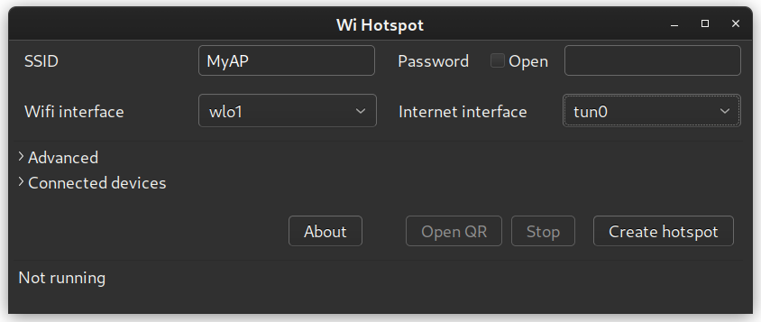

## Linux Wifi Hotspot

<!-- [](https://travis-ci.com/lakinduakash/linux-wifi-hotspot) -->

[](https://gitter.im/linux-wihotspot/community?utm_source=badge&utm_medium=badge&utm_campaign=pr-badge)
[](https://app.fossa.com/projects/git%2Bgithub.com%2Flakinduakash%2Flinux-wifi-hotspot?ref=badge_shield)

### What's new
* Share wifi via QR code
* UI improvements
* Show the connected devices
* Able to customize gateway address from GUI

### Features
 
* Share your wifi like in Windows - Use wifi and enable hotspot at the same time.
* Share a wifi access point from any network interface
* [Create a hotspot with VPN](#vpn-hotspot) - The hotspot has the traffic tunnelled through VPN. Useful for devices with no VPN app support like TV or gaming consoles.
* Share wifi via QR code
* MAC filter
* View connected devices
* Includes Both command line and gui.
* Support both 2.4GHz and 5GHz (Need to be compatible with your wifi adapter). Ex: You have connected to the 5GHz network and share a connection with 2.4GHz.
* Customise wifi Channel, Change MAC address, etc.
* Hide SSID
* customize gateway IP address
* Enable IEEE 80211n, IEEE 80211ac modes


### Command line help and documentation

Read [Command line help and documentation here](src/scripts/README.md).

If you only need the command-line without GUI run `make install-cli-only` as root user.

### Notes

- Sometimes there are troubles with **5Ghz bands** due to some vendor restrictions. If you cannot start hotspot while you are connected to 5Ghz band, Unselect **Auto** and select **2.4Ghz** in frequency selection.

- If any problems with **RealTeK Wifi Adapters** see [this](docs/howto/realtek.md)

- **Unable to allocate IP: firewalld issue:** Please check for potential fixes: [#209](https://github.com/lakinduakash/linux-wifi-hotspot/issues/209) [#166](https://github.com/lakinduakash/linux-wifi-hotspot/issues/166)

- **dnsmasq: cannot read /tmp/create_ap.wlo1.conf.*****/dnsmasq.conf: Permission denied**, on Manjaro or ArchLinux ; check [#183](https://github.com/lakinduakash/linux-wifi-hotspot/issues/183)

## Installation

#### Debian/Ubuntu

Download the debian package from latest [release](https://github.com/lakinduakash/linux-wifi-hotspot/releases/latest)

**OR**

```bash
# For ubuntu only
sudo add-apt-repository ppa:lakinduakash/lwh
sudo apt install linux-wifi-hotspot

```

#### Arch based distributions

Linux Wifi Hotspot is available as an [AUR package](https://aur.archlinux.org/packages/linux-wifi-hotspot/). You can install it manually or with your favourite AUR helper.  
For example, if you use `yay` you can do:  
`yay -S linux-wifi-hotspot`

## Dependencies

#### General
* bash
* util-linux (for getopt)
* procps or procps-ng
* hostapd
* iproute2
* iw
* iwconfig (you only need this if 'iw' can not recognize your adapter)
* haveged (optional)

_Make sure you have those dependencies by typing them in terminal. If any of dependencies fail
install it using your distro's package manager_

#### For 'NATed' or 'None' Internet sharing method
* dnsmasq
* iptables

#### To build from source

* make
* gcc and g++
* build-essential
* pkg-config
* gtk
* libgtk-3-dev
* libqrencode-dev (for qr code generation)
* libpng-dev (for qr code generation)

On Ubuntu or debian install dependencies by,

```bash
sudo apt install -y libgtk-3-dev build-essential gcc g++ pkg-config make hostapd libqrencode-dev libpng-dev
```

On Fedora/CentOS/Red Hat Enterprise Linux/Rocky Linux/Oracle Linux
```bash
sudo dnf install -y gtk3-devel gcc gcc-c++ kernel-devel pkg-config make hostapd qrencode-devel libpng-devel
```

## Installation

    git clone https://github.com/lakinduakash/linux-wifi-hotspot
    cd linux-wifi-hotspot

    #build binaries
    make

    #install
    sudo make install
    
## Uninstallation
    sudo make uninstall
    
## Running
You can launch the GUI by searching for "Wifi Hotspot" in the Application Menu
or using the terminal with:

    wihotspot
    
<h2 id="vpn-hotspot">Create VPN Hotspot</h2>

After connecting to VPN, Open `wihotspot` GUI. Select the virtual interface created by the VPN. In this case it is `tun0`




## Run on Startup
The `wihotspot` GUI uses `create_ap` to create and manage access points. This service and core logic was originally created by
[@oblique](http://github.com/oblique), and are now maintained in this
repository.

Start the hotspot service on startup (using your saved configuration) with:

    systemctl enable create_ap
    


## Contributing

If you found a bug or you have an idea about improving this make an issue. Even a small contribution make open source world more beautiful.
Please read [CONTRIBUTING.md](CONTRIBUTING.md) for more info.

## Disclaimer
<div>Icons made by <a href="https://www.freepik.com" title="Freepik">Freepik</a> from <a href="https://www.flaticon.com/" title="Flaticon">www.flaticon.com</a></div>


## Stargazers over time

[](https://starchart.cc/lakinduakash/linux-wifi-hotspot)


## License
FreeBSD

Copyright (c) 2013, oblique

Copyright (c) 2021, lakinduakash


[](https://app.fossa.com/projects/git%2Bgithub.com%2Flakinduakash%2Flinux-wifi-hotspot?ref=badge_large)
